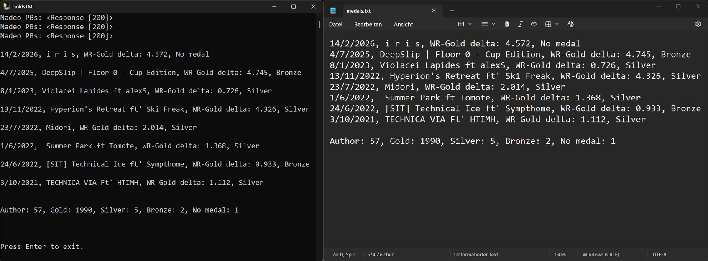

[](https://www.python.org/)
[](https://hub.docker.com/r/luniphys/trackmania-medals)
[](LICENSE)

# Trackmania TOTD Gold Medal Tracker

A command-line tool that helps you track your progress toward earning Gold medals on every Track of the Day (TOTD) in Trackmania 2020 since its release. Browsing every TOTD in-game is slow and tedious — this tool automates the process and gives you a clear overview of what's left.



## Table of Contents

- [Features](#features)
- [Project Structure](#project-structure)
- [How It Works](#how-it-works)
- [Prerequisites](#prerequisites)
- [Usage](#usage)
- [Docker](#docker)
- [Feedback](#feedback)


## Features

- Lists all TOTDs where you are still missing the Gold medal
- Displays for each track: **Date**, **Track name**, **Time gap (World Record → Gold medal time)**, and your **current personal medal**
- Outputs results both to the console and as a `.txt` file on the desktop
- Summarizes your total medal count of all TOTD maps at the end


## Project Structure

```
├── config/
│   ├── accountId.txt          # Your Trackmania account ID
│   └── credentials.json       # Ubisoft login credentials
├── data/
│   ├── TOTDMaps.json          # TOTD map metadata
│   ├── MedalMaps.json         # Medal times per map
│   ├── PBMaps.json            # Your personal bests
│   └── Final.json             # Merged data
├── output/
│   └── medals.txt             # Result file
├── src/trackmania-medals/
│   ├── main.py                # Map data retrieving functions
│   └── tokens.py              # Token generation functions
└── tokens/                    # Stored tokens
```


## How It Works

### Authentication

`tokens.py` handles the full authentication flow:

1. Getting for **access** and **refresh tokens** for the Nadeo API.
2. Refresh tokens are used to renew access tokens before they expire.
3. Two separate Nadeo API audiences are used: **Core** & **Live**.
4. A separate OAuth flow connects to the Trackmania OAuth API to retrieve your **account ID**, which is required for personal best times (PBs) on each map.

### Data Collection

Once authenticated, `main.py` performs the following steps:

1. Fetches TOTD map metadata (map IDs, dates, names) from the Nadeo Live API and stores it as `TOTDMaps.json`.
2. Fetches medal times for each map from the Nadeo Core API and stores them as `MedalMaps.json`.
3. Fetches your personal best times for every TOTD using your account ID and stores them as `PBMaps.json`.
4. Merges all data into a compact `Final.json` containing only the fields needed.

All JSON files are stored locally under `data/` to reduce redundant API calls.


## Prerequisites

- Python 3.x
- A Trackmania 2020 account (Ubisoft login)
- Required Python packages (install via `pip`):
  ```
  requests
  numpy
  ```


## Usage

1. Clone the repository.
  ```bash
   git clone https://github.com/luniphys/trackmania-medals.git
   ```
2. Install Python packages
  ```bash
   pip install -r requirements.txt
   ```
3. Run `main.py`:
  ```bash
   python src/trackmania-medals/main.py
   ```
3. On first run, enter your Ubisoft credentials. Tokens are saved locally for future runs.

> **Note:** The Nadeo API has a rate limit of **2 requests per second**. The tool automatically pauses between requests to stay within limits. As a result, the first run takes over **1 minute**. (Subsequent runs, with cached data, are faster).

> **Note:** The token retrievement is also done via `main.py`, so there's no need to run `tokens.py`.


## Docker

A Dockerfile is included to provide a reproducible runtime environment with all required dependencies.

### Build the image

From the repository root, build the Docker image with:

```bash
docker build -t trackmania-medals .
```

### Pull from Docker Hub

A prebuilt image is also available on [Docker Hub](https://hub.docker.com/r/luniphys/trackmania-medals):

```bash
docker pull luniphys/trackmania-medals
```

### Run the container

```bash
docker run --rm -it -p 8765:8765 trackmania-medals
```

### Notes

- Run the container in interactive mode: ```-it```
- You may need to manually open the OAuth URL in your browser to identify with your Ubisoft login. Instructions are shown!


## Feedback

Bug reports, suggestions, and general feedback are welcome. Feel free reach out :)
